**Rajvir** — AI/ML student building on the backend side of things.

Backend developer, currently working with Node.js, Express, and MongoDB.
Also picking up Python and FastAPI on the side.

`javascript typescript python node.js express mongodb fastapi git`

Every graphic on this page is generated from this repository's own scripts —
nothing is pulled from a third-party stats service. `ascii.svg` comes from
`scripts/make_portrait.py`, generated once and not on a schedule. The rest
come from `scripts/generate_stats.py`, run daily by a scheduled GitHub Action
that commits only what changed.